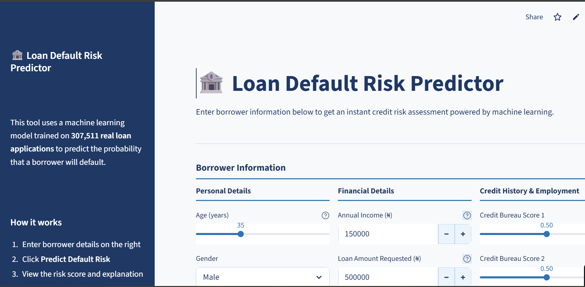
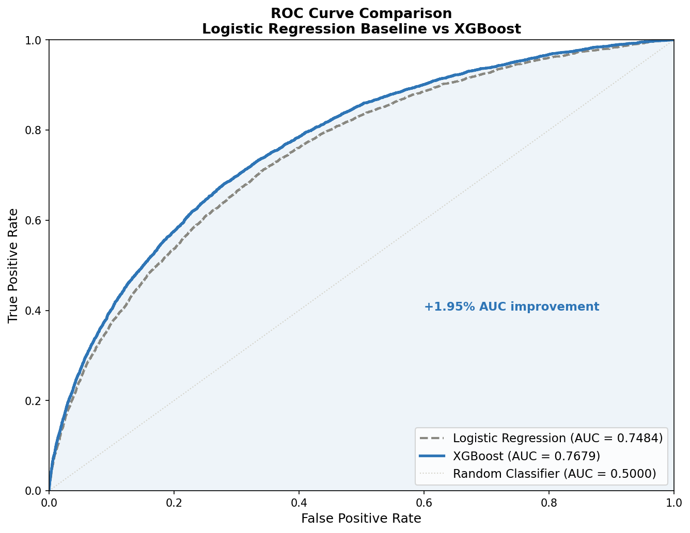
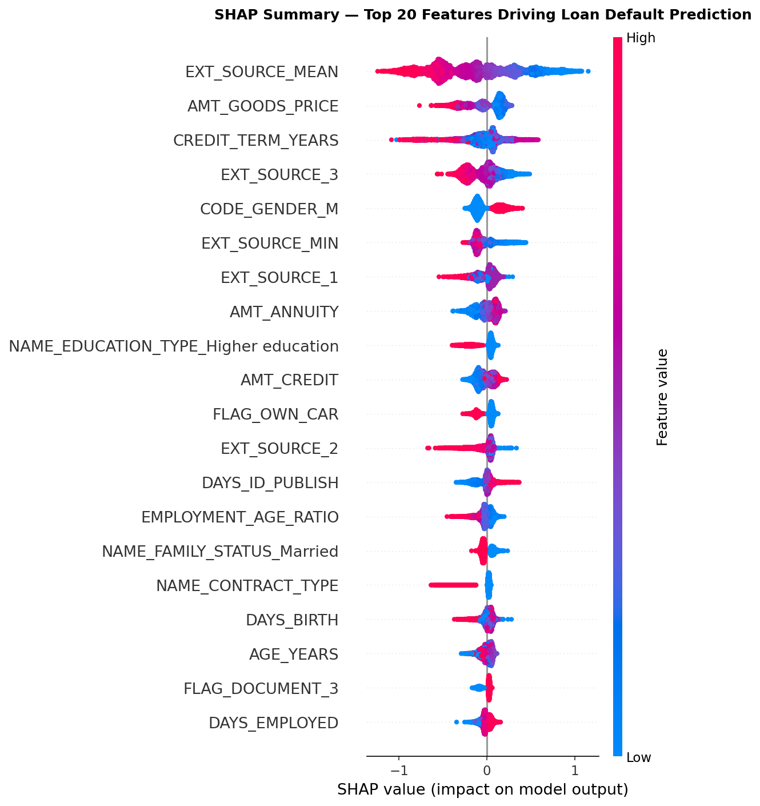
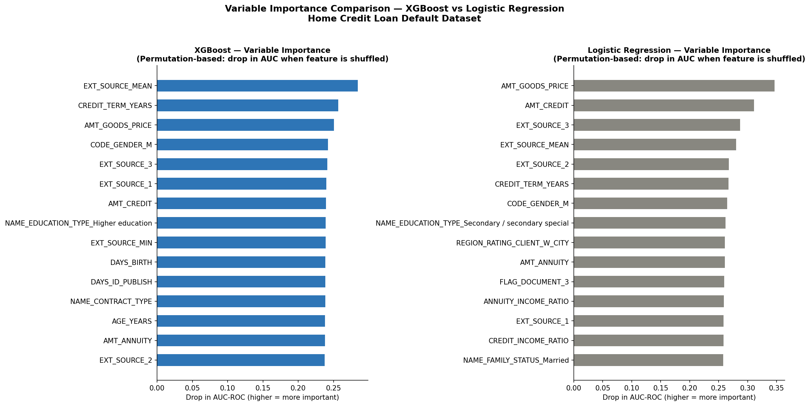
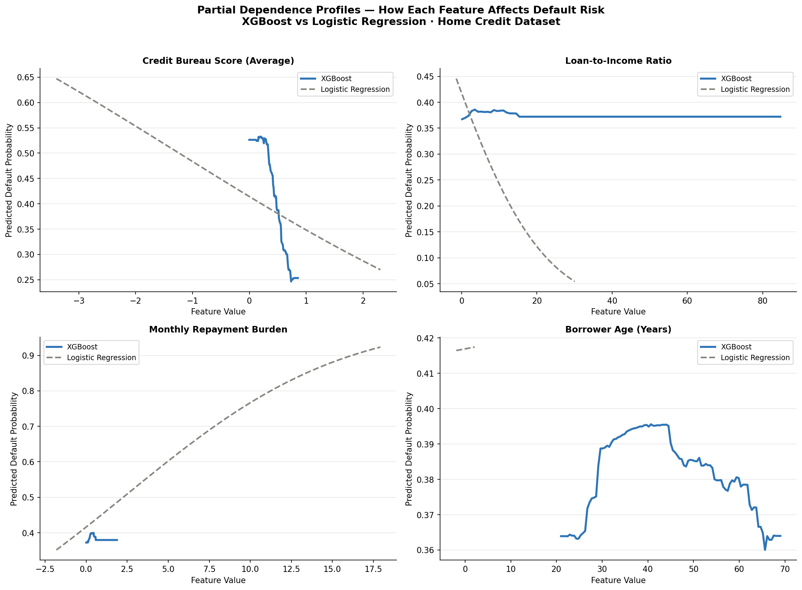
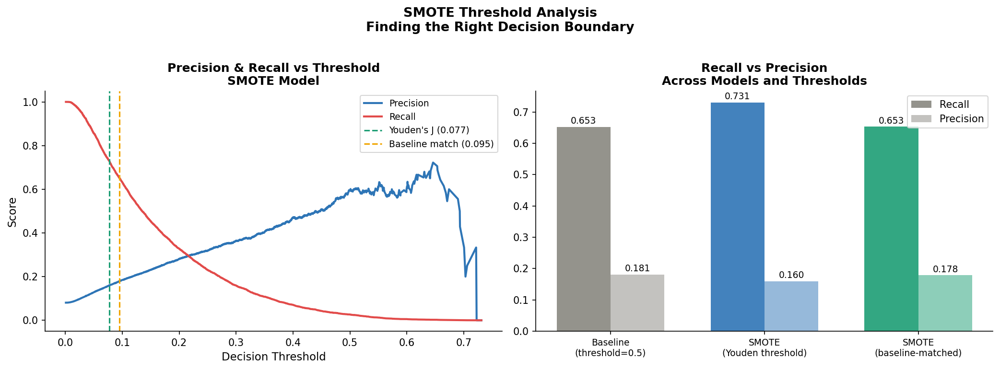
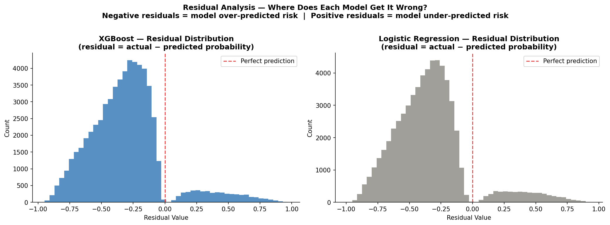

# 🏦 Loan Default Prediction System

> **Predicting loan default risk for Nigerian microfinance banks and fintechs —
> powered by XGBoost, explained by SHAP, and built for fair lending compliance**

## 🚀 Live Demo
**[👉 Open the Live App](https://rotech-loan-default-predictor.streamlit.app/)**

> Enter borrower details and get an instant ML-powered credit risk assessment
> with a plain-English SHAP explanation — no code required.



---

## ⚖️ Fair Lending & Regulatory Compliance

This model was built with institutional deployment in mind.

| Principle | Implementation |
|-----------|---------------|
| **Gender-neutral** | Gender removed after Dalex analysis — only 0.0015 AUC impact |
| **Explainable** | Every prediction explained via SHAP — no black box decisions |
| **Transparent** | Full methodology documented across 7 notebooks |
| **Auditable** | All code open source on GitHub |
| **CBN-ready** | Fair lending principles applied throughout |
| **Decision support** | Explicit disclaimer — model aids judgement, does not replace it |
| **Adjustable thresholds** | MFBs can configure risk bands to match their credit policy |
| **Full market range** | No income or loan size caps — covers micro to commercial lending |

> A model retrained on institution-specific data with local FC/CRC bureau
> scores would be required for live deployment at a CBN-regulated MFB or fintech.

---

## 🎯 The Business Problem

Every year, Nigerian microfinance banks and fintechs lose billions of naira
to loan defaults, not because of bad judgement, but because manual credit
assessment cannot process enough signals fast enough.

A loan officer reviewing 40 applications a day using a 2019 spreadsheet
cannot simultaneously weigh bureau scores, debt burden, employment stability,
and household income for every applicant.

This system does — covering the full range of the Nigerian lending market,
from microfinance to commercial facilities, with no upper income or loan limits.

---

## 📊 Project Overview

| | |
|---|---|
| **Dataset** | Home Credit Default Risk (Kaggle) |
| **Records** | 307,511 loan applications |
| **Features** | 122 original → 100 engineered (gender-free) |
| **Target** | Binary — loan default (1) or repaid (0) |
| **Class imbalance** | 8.07% default rate |
| **Best model** | XGBoost (gender-neutral) |
| **AUC-ROC** | 0.7664 |
| **Recall** | 65.3% of defaults caught |
| **Income range** | No upper limit — full Nigerian market |
| **Risk thresholds** | Adjustable per institution credit policy |

---

## 🔍 Key Findings

**0. Gender-Neutral Credit Scoring**
Dalex explainability analysis identified gender as the fourth most important
feature in the original model. Following this finding, the model was retrained
without gender. AUC-ROC dropped by only 0.0015, confirming that
creditworthiness is determined entirely by financial behaviour, not demographic
characteristics. The deployed model is gender-neutral and fair lending compliant.

**1. Class imbalance is the core challenge**
Only 8.07% of borrowers defaulted. A naive model predicting "no default" for
everyone achieves 91.9% accuracy, but catches zero bad loans. AUC-ROC and
Recall are the only metrics that matter here.

**2. External credit bureau scores dominate**
EXT_SOURCE_MEAN (average of three bureau scores) is the single strongest
predictor of default — confirming what credit officers have always known
intuitively about the importance of credit history. Dalex permutation importance
confirmed a 28% drop in AUC when bureau scores are removed.

**3. A threshold effect exists at bureau score 0.5**
Dalex partial dependence profiles revealed a non-linear threshold at approximately
0.5. Borrowers below this threshold face dramatically higher default probability.
Logistic Regression models this as linear and misses the threshold entirely —
one of the core reasons XGBoost outperforms it.

**4. Debt burden matters more than loan size**
ANNUITY_INCOME_RATIO (monthly repayment relative to income) is a stronger
predictor than the raw loan amount. A borrower's financial stretch before
the loan is disbursed predicts their ability to repay after.

**5. Loan default is not an anomaly detection problem**
Isolation Forest (AUC: 0.5213) and One-Class SVM (AUC: 0.4535) both failed
to detect defaults reliably, confirming that defaulters are not structural
outliers. The subtle combinations of features that distinguish them are only
visible to a model trained on labelled default outcomes.

**6. Age affects default risk non-linearly**
Dalex partial dependence revealed a hump-shaped age profile — default risk
peaks around age 40-42 then declines toward retirement. This pattern is
invisible to Logistic Regression but captured by XGBoost.

**7. SMOTE does not improve underlying discriminatory ability**
SMOTE experimentation confirmed that threshold optimisation — not synthetic
oversampling — is the correct lever for recall improvement on this dataset.
At the Youden optimal threshold, recall improves to 73.1% without synthetic
data generation. The baseline model's Precision-Recall curve and SMOTE's
are nearly identical (AP: 0.256 vs 0.246).

---

## 🛠 Technical Stack

| Layer | Tools |
|-------|-------|
| Data processing | Python, pandas, NumPy |
| ML modelling | scikit-learn, XGBoost |
| Explainability | SHAP, Dalex |
| Anomaly detection | Isolation Forest, One-Class SVM |
| Imbalance handling | SMOTE, threshold optimisation |
| Visualisation | matplotlib, seaborn, Plotly |
| Deployment | Streamlit, Streamlit Cloud |
| Version control | Git, GitHub |

---

## 📁 Project Structure

```
loan-default-prediction/
├── app/
│   └── app.py                         ← Streamlit web application
├── data/
│   └── processed/                     ← cleaned dataset (local only)
├── models/
│   ├── xgb_model_no_gender.pkl        ← deployed gender-free model
│   ├── feature_names_no_gender.pkl    ← gender-free feature list
│   ├── xgb_model.pkl                  ← original model (reference)
│   └── feature_names.pkl              ← original feature list
├── notebooks/
│   ├── 01_eda.ipynb                   ← exploratory data analysis
│   ├── 02_feature_engineering.ipynb   ← domain-driven features
│   ├── 03_baseline_model.ipynb        ← logistic regression baseline
│   ├── 04_xgboost_shap.ipynb          ← XGBoost + SHAP + gender-free retrain
│   ├── 05_anomaly_detection.ipynb     ← Isolation Forest + One-Class SVM
│   ├── 06_dalex_explainability.ipynb  ← portfolio-level explanation
│   └── 07_smote_experiment.ipynb      ← SMOTE vs threshold optimisation
├── reports/
│   ├── missing_values.png
│   ├── target_distribution.png
│   ├── feature_correlations.png
│   ├── engineered_features.png
│   ├── roc_curve_baseline.png
│   ├── roc_comparison.png
│   ├── shap_summary.png
│   ├── shap_waterfall.png
│   ├── shap_dependence.png
│   ├── dalex_variable_importance.png
│   ├── dalex_partial_dependence.png
│   ├── dalex_residuals.png
│   ├── dalex_breakdown.png
│   ├── model_comparison_full.png
│   ├── smote_comparison.png
│   └── smote_threshold_analysis.png
├── .streamlit/
│   └── config.toml
├── requirements.txt
└── README.md
```

---

## 📈 Model Performance

### Baseline vs Champion

| Metric | Logistic Regression | XGBoost (Original) | XGBoost (Gender-Free) |
|--------|-------------------|--------------------|-----------------------|
| AUC-ROC | 0.7484 | 0.7679 | **0.7664** |
| Recall | — | 65.8% | **65.3%** |
| F1 Score | — | 0.2836 | **0.2813** |
| Gender used | No | Yes | **No ✅** |

### Supervised vs Unsupervised

| Approach | Model | AUC-ROC | Recall | Verdict |
|----------|-------|---------|--------|---------|
| Supervised | XGBoost (gender-free) | 0.7664 | 65.3% | ✅ Deployed |
| Supervised | Logistic Regression | 0.7484 | — | Baseline |
| Unsupervised | Isolation Forest | 0.5213 | 9.2% | ❌ Insufficient |
| Unsupervised | One-Class SVM | 0.4535 | 5.4% | ❌ Insufficient |
| SMOTE + Youden threshold | XGBoost | 0.7637 | 73.1% | ⚡ Threshold-dependent |

> Anomaly detection approaches failed to reliably detect defaults —
> confirming that loan default is a supervised classification problem,
> not an anomaly detection problem.

### ROC Curve Comparison


### SHAP Summary — Top 20 Risk Drivers


### Dalex Variable Importance


### Dalex Partial Dependence Profiles


### SMOTE Threshold Analysis


---

## ⚙️ Feature Engineering

9 domain-driven features created from credit risk expertise:

| Feature | Business Meaning |
|---------|-----------------|
| `CREDIT_INCOME_RATIO` | Loan size relative to annual income |
| `ANNUITY_INCOME_RATIO` | Monthly repayment burden vs income |
| `CREDIT_TERM_YEARS` | Effective loan repayment duration |
| `INCOME_PER_PERSON` | Income per household member |
| `EXT_SOURCE_MEAN` | Average of all bureau scores |
| `EXT_SOURCE_MIN` | Weakest bureau score signal |
| `AGE_YEARS` | Borrower age in years |
| `EMPLOYMENT_YEARS` | Employment length in years |
| `EMPLOYMENT_AGE_RATIO` | Employment stability index |

---

## 🔬 Explainability Analysis (Dalex)

Dalex was used to analyse model behaviour at a portfolio level —
complementing the individual-prediction SHAP analysis.

**Key Dalex findings:**

- EXT_SOURCE_MEAN drives 28% of model performance — removing it collapses AUC-ROC
- A non-linear threshold exists at bureau score ≈ 0.5 — invisible to Logistic Regression
- Age risk peaks at 40-42 years — hump-shaped profile captured only by XGBoost
- Both models over-predict risk (mean residual ≈ -0.31) — expected consequence of imbalance handling
- Gender was fourth most important in original model — removed for fair lending compliance



---

## 🏦 App Features

The live Streamlit application includes:

- **Full Nigerian market range** — no income or loan size caps
- **Adjustable risk thresholds** — institutions set their own Medium and High Risk bands
- **SHAP explanation chart** — every prediction explained in plain English
- **Decision support disclaimer** — explicit reminder that model aids, not replaces, judgement
- **Credit file summary** — ready-to-document assessment output for loan files
- **Fair lending declaration** — gender-neutral, CBN compliant messaging throughout

---

## 🚀 Run Locally

```bash
# Clone the repo
git clone https://github.com/abiolalawal14/loan-default-prediction.git
cd loan-default-prediction

# Install dependencies
pip install -r requirements.txt

# Run the app
cd app
streamlit run app.py
```

---

## 📌 Roadmap

- [x] Exploratory data analysis
- [x] Feature engineering — 9 domain features
- [x] Logistic Regression baseline (AUC: 0.7484)
- [x] XGBoost champion model (AUC: 0.7679)
- [x] SHAP explainability — individual predictions
- [x] Streamlit deployment — live app
- [x] Anomaly detection — Isolation Forest + One-Class SVM
- [x] Dalex explainability — portfolio-level analysis
- [x] Gender-neutral model — fair lending compliance (AUC: 0.7664)
- [x] SMOTE experimentation — threshold analysis (recall: 73.1% at Youden threshold)
- [x] Full Nigerian market range — income and loan caps removed
- [x] Adjustable risk thresholds — institution-configurable
- [x] Decision support disclaimer — human judgement reinforcement
- [ ] NIBSS BVN integration — auto-populate FC/CRC bureau scores
- [ ] Hyperparameter tuning
- [ ] FastAPI REST endpoint
- [ ] Project 2 — Fraud Detection Engine

---

## 🏦 For MFB & Fintech Institutions

This tool is currently a demonstration system trained on international data.

**For institutional adoption, four steps are required:**

1. **Data Assessment** — review 3-5 years of historical loan data with repayment outcomes
2. **Model Retraining** — retrain on institution-specific data using actual FC/CRC bureau scores
3. **Portfolio Validation** — validate against existing NPL portfolio and calibrate risk thresholds to your credit policy
4. **Compliance Review** — CBN fair lending guidelines review before live deployment

**The app's adjustable threshold feature allows institutions to plug in their
own risk bands immediately — without retraining — as a starting point for
evaluation.**

**Interested in a custom deployment for your institution?**
Contact: abiolalawal14@gmail.com

---

## 👨‍💻 About the Author

**Abiola Lawal** — Data Scientist | Credit Risk & Fintech ML

5+ years of applied experience in credit risk analysis,
development sector M&E analytics, and data skills training.
Former Credit Risk Analyst — Nigerian microfinance bank (₦500M+ portfolio).
Founder of Rotech Data Consult — data analytics training academy, Abuja.

- 🌐 [Portfolio](https://abiolalawal14.vercel.app/)
- 💼 [LinkedIn](https://linkedin.com/in/abiola-lawal-abdulrafiu)
- 💻 [GitHub](https://github.com/abiolalawal14)
- 📧 abiolalawal14@gmail.com

---

> *"Machine learning doesn't replace domain knowledge. It scales it."*

> *"A credit model that needs gender to make decisions is not measuring
> creditworthiness — it is measuring demographics."*
> — Finding from Dalex analysis, March 2026